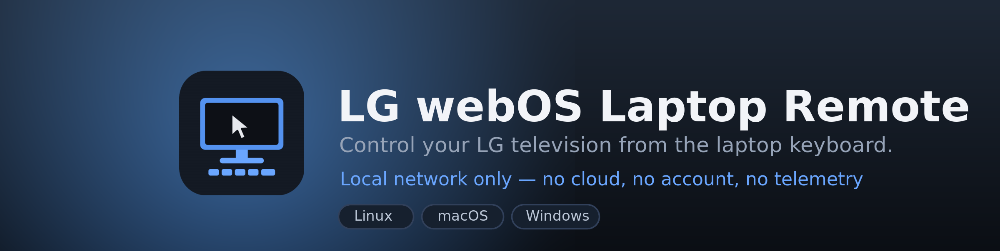
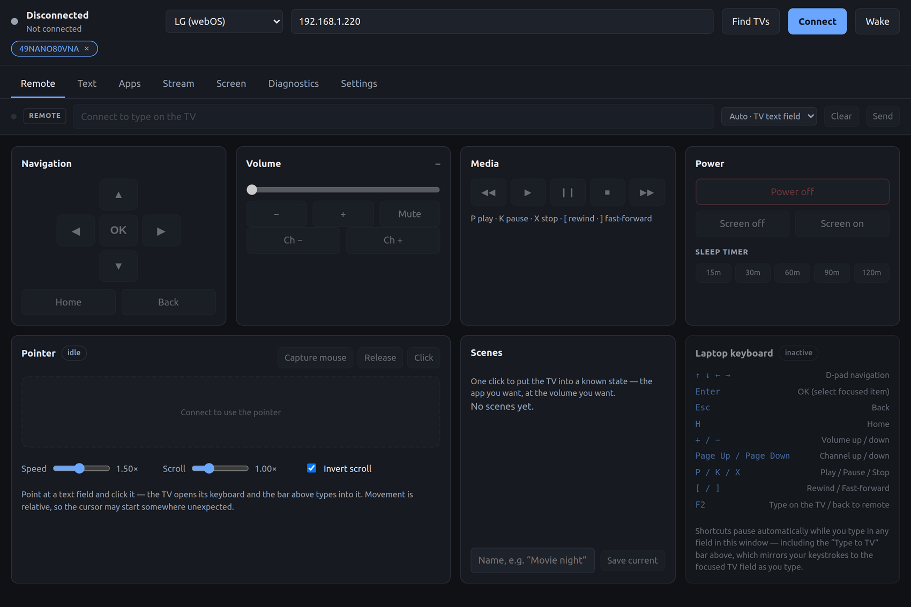
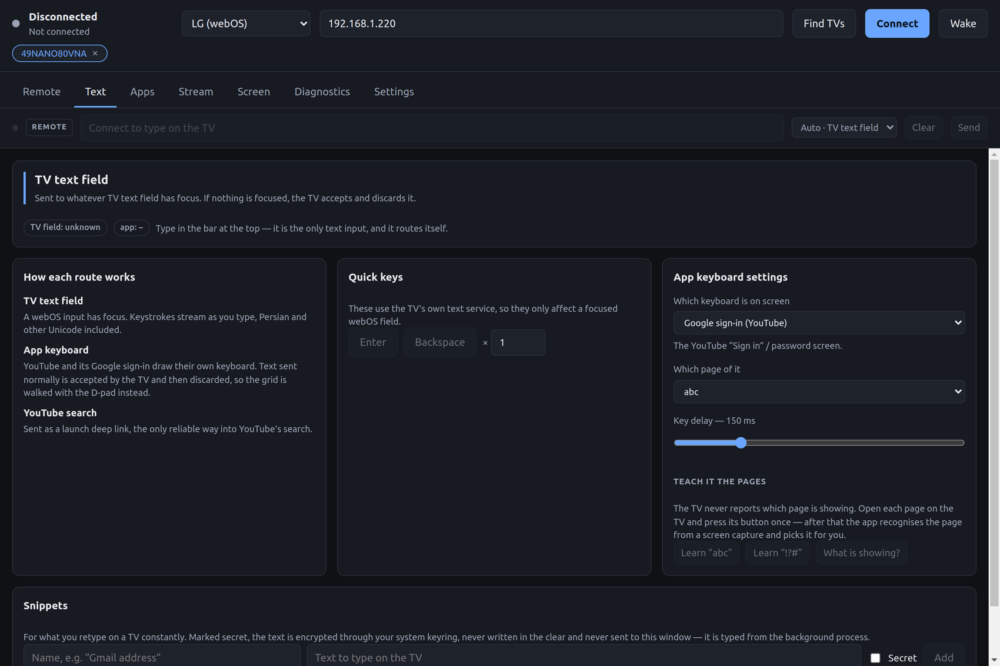
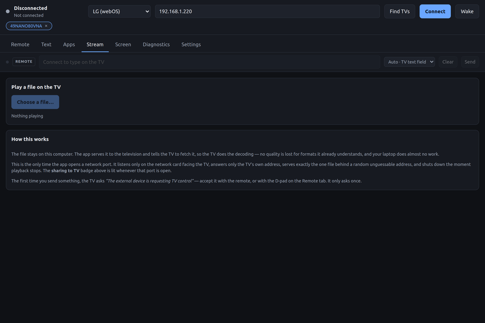
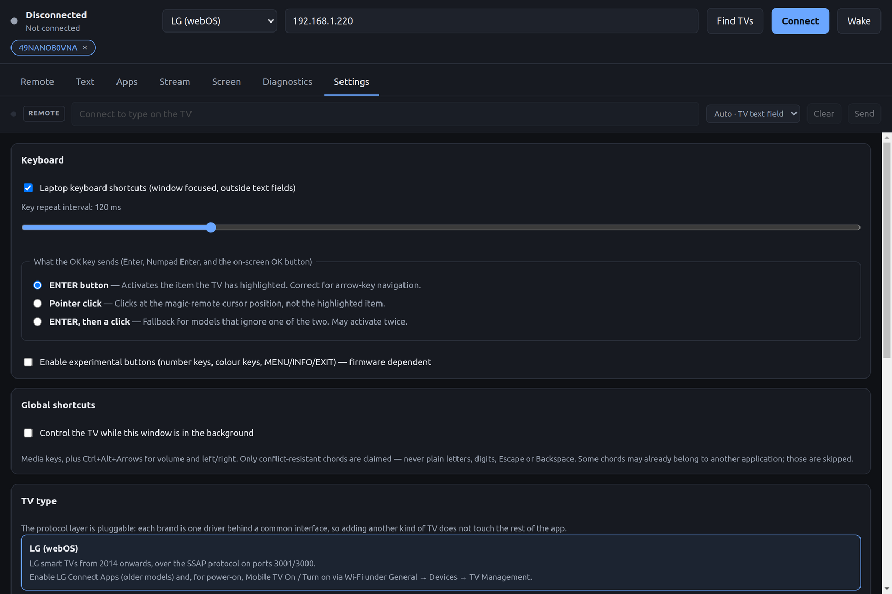
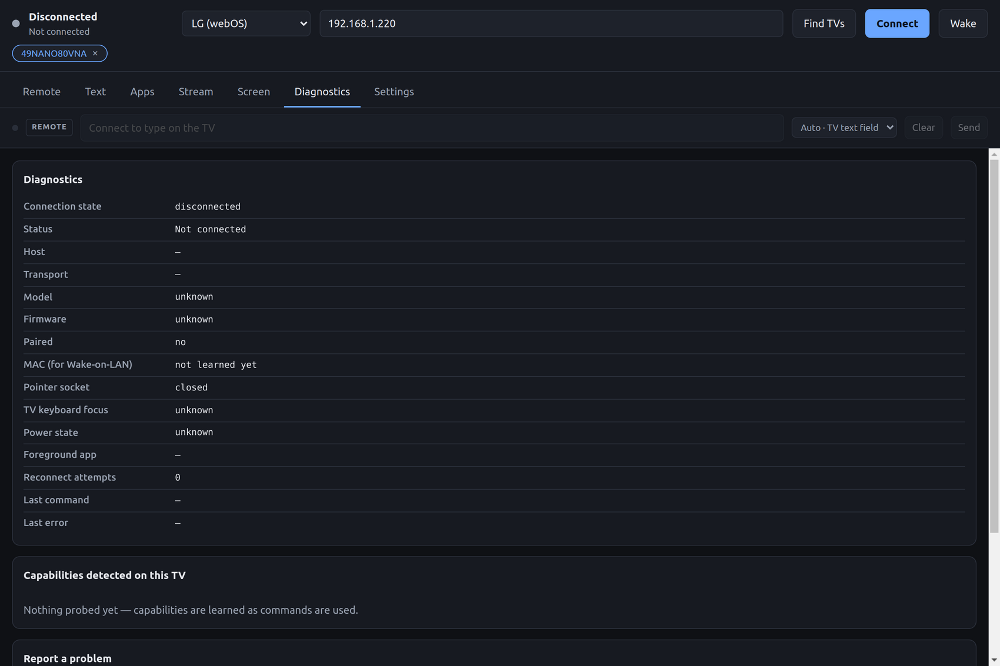

<div align="center">



[](https://github.com/mostafaebrahimi/lg-webos-laptop-remote/actions/workflows/ci.yml)
[](https://github.com/mostafaebrahimi/lg-webos-laptop-remote/actions/workflows/release.yml)
[](#download)
[](https://www.electronjs.org/)
[](LICENSE)

**[Download](#download)**&nbsp; · &nbsp;**[Setup](#setup)**&nbsp; · &nbsp;**[Features](#features)**&nbsp; · &nbsp;**[Troubleshooting](#troubleshooting)**&nbsp; · &nbsp;**[Build from source](#building-from-source)**

</div>

---

Control an LG television running webOS from a Linux, macOS or Windows laptop. The app
speaks the TV's own SSAP WebSocket protocol directly — the same one LG's phone remote
uses — so nothing sits between your keyboard and the screen across the room. No cloud
service, no account, no telemetry, no open ports except while you are deliberately
streaming a file.

<div align="center">
  
</div>

<br>

| | |
| --- | --- |
| ⌨️ **Type on the TV** | One bar that routes itself — a focused webOS field, an app's own on-screen keyboard driven key by key, or a YouTube deep link |
| 🖱️ **Pointer** | Your touchpad moves the TV cursor: click, scroll, right-click as Back |
| 📺 **Apps and inputs** | Live app list with real icons, favourites, running badges, HDMI switching |
| 🎬 **Stream a local file** | DLNA push with seek, and automatic remux or transcode when the TV cannot decode it |
| 📸 **Screen** | Capture the TV picture, watch it live, record to MP4 or GIF |
| 🎛️ **Scenes and snippets** | One click for "app plus volume"; reusable strings, secrets held in the OS keyring |
| ⚡ **Command palette** | `Ctrl+K` for any app, input, scene or action by name |
| 🔍 **Discovery** | SSDP "Find TVs", several saved televisions, Wake-on-LAN |

### A look around

<table>
<tr>
<td width="50%" valign="top">

<p align="center"><b>Text</b> — one input, three routes, and the app-keyboard page tracker</p>
</td>
<td width="50%" valign="top">

<p align="center"><b>Stream</b> — push a local file to the TV over DLNA</p>
</td>
</tr>
<tr>
<td width="50%" valign="top">

<p align="center"><b>Settings</b> — key repeat, what OK sends, global shortcuts, TV driver</p>
</td>
<td width="50%" valign="top">

<p align="center"><b>Diagnostics</b> — capability map and a report with the address redacted</p>
</td>
</tr>
</table>

<sub>Screenshots taken with the television powered off, which is why the live panels sit
empty — the app is showing its disconnected state, not a mock-up.</sub>

---

## Contents

- [Download](#download)
- [Requirements](#requirements)
- [Setup](#setup)
- [Keyboard map](#laptop-keyboard-map)
- [Features](#features)
- [Building from source](#building-from-source)
- [Packaging](#packaging)
- [Architecture](#architecture)
- [How the hard parts work](#how-the-hard-parts-work)
- [Compatibility and limitations](#compatibility-and-limitations)
- [Troubleshooting](#troubleshooting)
- [Verified against a real TV](#verified-against-a-real-tv)
- [Testing](#testing)
- [Privacy](#privacy)
- [Contributing](#contributing)
- [License](#license)

---

## Download

Grab the newest installer from the [Releases page](https://github.com/mostafaebrahimi/lg-webos-laptop-remote/releases/latest).

| Platform | File | Notes |
| --- | --- | --- |
| **Linux** | `…-linux-x86_64.AppImage` | `chmod +x` it and run — nothing to install |
| **Linux** | `…-linux-amd64.deb` | `sudo apt install ./lg-webos-laptop-remote-*.deb` |
| **macOS (Apple Silicon)** | `…-mac-arm64.dmg` | M1 and newer |
| **macOS (Intel)** | `…-mac-x64.dmg` | |
| **Windows** | `…-win-x64.exe` | NSIS installer, per-user, no admin needed |
| **Windows** | `…-windows-portable.exe` | single file, no installation |

The `.deb` registers a desktop entry and icons at every size from 16px to 512px.

### The builds are not code-signed

There is no Apple Developer or Authenticode certificate behind this project, so the
operating system will warn you the first time:

- **macOS** — right-click the app → **Open** → **Open**, or clear the quarantine flag:
  ```bash
  xattr -dr com.apple.quarantine "/Applications/LG webOS Laptop Remote.app"
  ```
- **Windows** — SmartScreen → **More info** → **Run anyway**.

If you would rather not trust a binary from a stranger, [build it yourself](#building-from-source);
it takes one command.

## Requirements

- An LG television running **webOS 3.0 or newer** on the same local network.
- The laptop and the TV on the **same non-guest** subnet (no AP client isolation).
- **`ffmpeg` and `ffprobe` on `PATH` — optional.** Everything except MP4/GIF recording
  and stream remux/transcode works without them; those features detect their absence
  and say so rather than failing silently.
  - Debian/Ubuntu: `sudo apt install ffmpeg`
  - macOS: `brew install ffmpeg`
  - Windows: `winget install Gyan.FFmpeg`
- For development: **Node.js 22** or newer.

## Setup

1. Put the laptop and the TV on the **same non-guest** local network.
2. Find the TV IP: *Settings → General → Network → Wi-Fi/Wired Connection → Advanced*.
3. On the TV, enable **LG Connect Apps** (older models) and, for power-on,
   **Mobile TV On** / **Turn on via Wi-Fi** (*General → Devices → TV Management*).
4. Start the app, enter the IP, press **Connect** — or press **Find TVs** and let SSDP
   discovery locate it.
5. **Accept the pairing prompt on the television** with the physical remote. The key is
   stored under Electron's `userData` directory and reused automatically afterwards.
6. To send text, open a search or login field **on the TV first**.
7. For Wake-on-LAN, make sure the MAC is set (learned automatically after pairing, or
   entered in Settings).

Where the pairing key and settings live:

| Platform | Path |
| --- | --- |
| Linux | `~/.config/LG webOS Laptop Remote/` |
| macOS | `~/Library/Application Support/LG webOS Laptop Remote/` |
| Windows | `%APPDATA%\LG webOS Laptop Remote\` |

## Laptop keyboard map

Shortcuts are active only while the window is focused, the TV is connected, and the
focus is **not** in a text field. They pause automatically while you type.

| Key | Action |
| --- | --- |
| `↑ ↓ ← →` | D-pad (pointer buttons, auto-repeat throttled) |
| `Enter` | OK — sends the `ENTER` pointer button, which activates the item the TV has highlighted (switchable in Settings) |
| `Esc` / `Backspace` | Back |
| `H` | Home |
| `+` / `−` | Volume up / down |
| `Page Up` / `Page Down` | Channel up / down |
| `P` / `K` / `X` | Play / Pause / Stop |
| `[` / `]` | Rewind / Fast-forward |
| `Ctrl+K` | Command palette — any app, input, scene or action by name |
| `0`–`9`, `F1`–`F4` | Number and colour buttons — **only** when "experimental buttons" is enabled in Settings (firmware dependent) |

Volume, channel and media use their dedicated SSAP endpoints, not pointer-button
guesses.

**Optional system-wide shortcuts** (off by default, enabled in Settings): the media
keys, `Ctrl+Alt+Arrows`, and `Ctrl+Alt+V` to send the clipboard to the TV. On macOS,
capturing the media keys requires granting the app **Accessibility** permission in
*System Settings → Privacy & Security*.

## Features

| Area | What it does |
| --- | --- |
| **Remote** | D-pad, OK, Home/Back, volume with a live level, channels, media transport, power, screen on/off, sleep timer |
| **Pointer** | Trackpad surface driving the TV cursor; click, right-click as Back, wheel scroll, adjustable speed |
| **Typing** | One input that routes itself: focused webOS field, an app's own on-screen keyboard, or a YouTube deep link |
| **Snippets** | Reusable strings; secret ones are encrypted through the OS keyring and never reach the UI process |
| **Scenes** | One click to put the TV into a known state — app plus volume |
| **Apps** | Live app list with real icons, favourites, running badge, close, filter; input switching |
| **Screen** | Capture, 1 fps live view, save, record at 1–5 fps, MP4 and animated GIF export |
| **Stream** | Play a local video or audio file on the TV over DLNA, with play/pause/seek and automatic remux or transcode |
| **Command palette** | `Ctrl+K` — any app, input, scene or action by name |
| **Tray** | Volume, mute, transport, clipboard-to-TV and power without opening the window |
| **Global shortcuts** | Opt-in media keys, `Ctrl+Alt+Arrows`, and `Ctrl+Alt+V` to send the clipboard |
| **Discovery** | SSDP "Find TVs", plus multiple saved televisions |
| **Diagnostics** | Capability map, live state, and a shareable report with the address redacted |

### Interface

Seven tabs — Remote, Text, Apps, Stream, Screen, Diagnostics, Settings — on one card
grid that reflows at 1250px, 1050px, 960px and 700px. Screenshots of every tab at two
widths are checked for horizontal overflow as part of the test run:
`scripts/shots.mjs` reports any element whose content is wider than its container, so
a clipped button cannot ship unnoticed.

## Building from source

```bash
git clone https://github.com/mostafaebrahimi/lg-webos-laptop-remote.git
cd lg-webos-laptop-remote
npm install
npm run dev
```

| Command | What it does |
| --- | --- |
| `npm run dev` | electron-vite dev server with HMR |
| `npm start` | run the built app |
| `npm run build` | typecheck + production build |
| `npm run typecheck` | `tsc --noEmit` over both tsconfigs |
| `npm test` | unit tests (Vitest) |
| `npm run test:e2e` | end-to-end checks against a real TV |
| `npm run dev:debug` | build and launch with the DevTools protocol open on 9222 |

## Packaging

```bash
npm run package:linux   # .deb (apt) and AppImage
npm run package:mac     # .dmg and .zip, x64 and arm64
npm run package:win     # NSIS installer and portable .exe
```

Installers land in `release/`. Each target must be built on its own operating
system — electron-builder cannot produce a signed, working `.dmg` from Linux, and
Windows installers need a Windows runner. That is what the CI is for.

### Continuous integration

| Workflow | Trigger | What it does |
| --- | --- | --- |
| [`ci.yml`](.github/workflows/ci.yml) | every push to `main` and every PR | typecheck, build and unit tests on Ubuntu, macOS and Windows |
| [`release.yml`](.github/workflows/release.yml) | pushing a `v*` tag, or manual dispatch | packages on all three runners, then publishes every installer to a GitHub release |

Cutting a release:

```bash
npm version patch      # or minor / major — bumps package.json and tags
git push --follow-tags
```

The tag push builds Linux, macOS (x64 + arm64) and Windows in parallel and attaches
the installers to a release named after the tag.

Signing is optional and off by default. To sign, add repository secrets
`CSC_LINK` (a base64-encoded `.p12`) and `CSC_KEY_PASSWORD` for macOS, and
`WIN_CSC_LINK` / `WIN_CSC_KEY_PASSWORD` for Windows; the workflow picks them up
automatically and skips signing when they are absent.

## Architecture

```
src/
  main/       Electron main process — owns the only TV connection
    tv/       driver registry, connection manager, pointer socket, command registry
    discovery/SSDP search
    stream/   DLNA renderer, media probe, one-file HTTP server, transcoder
    shortcuts/global accelerators
    ipc/      Zod-validated IPC handlers, allowlisted commands only
    settings/ atomic JSON settings store and keyring-backed secrets
    util/     text chunking, backoff, error sanitising, YouTube parsing
  preload/    contextBridge surface (no ipcRenderer, no raw SSAP, no fs)
  renderer/   React + Vite UI
  shared/     types and channel names used by both sides
tests/unit/   Vitest unit tests
docs/         implementation spec
scripts/      probe and debug scripts that talk to a real TV
```

The renderer can never issue an arbitrary SSAP request: it may only send a member of
the `TvCommand` union, which the main process validates again before dispatching.

### Adding another TV brand

The protocol sits behind one interface. Nothing above `src/main/tv/drivers/` knows
about webOS, SSAP or lgtv2.

1. Implement `TvDriver` (`src/main/tv/drivers/types.ts`) for the brand.
2. Declare a `DriverDescriptor` — name, pairing hint, SSDP search target, and the
   `features` flags the UI reads to disable what the brand cannot do.
3. Register it in `src/main/tv/drivers/registry.ts`.

`src/main/tv/drivers/samsung/SamsungDriver.ts` is a worked example of the descriptor
half, with notes on the Tizen protocol.

## How the hard parts work

### Typing: one input, three routes

There is exactly one text input — the bar at the top of the window. It picks how to
reach the TV and says which route it is using:

| Route | When | How |
| --- | --- | --- |
| **TV text field** | the TV reports a focused webOS widget | `insertText`, streamed as you type, 60 ms coalescing, full Unicode |
| **App keyboard** | YouTube, the Google sign-in page, anything drawing its own grid | the grid is walked with the D-pad and OK, exactly as the physical remote does |
| **YouTube search** | YouTube open, nothing focused | launch deep link |

Verified on a real TV: `test@gmail.com` typed into the Google sign-in field on
YouTube by driving its keyboard — 14 characters, no mistakes — and `a$b`, which needs
the second keyboard page.

**Symbols and the page problem.** Characters like `$ ! # % & * + =` are not on the
letters page; they live behind the `!?#` key. The typer switches page, types, and
switches back. A character the keyboard has no key for at all is refused up front
with a message naming it, instead of being silently dropped.

The TV does not report which page its keyboard is showing, and it cannot be read back
any other way. The app therefore remembers where it left the keyboard, and the bar has
a `page:` selector to correct it if the physical remote switched pages behind the
app's back. Get it wrong and every key comes out exactly one page off.

**Why the routing exists at all.** `insertText` returns success whenever the IME
service exists, **whether or not any field is focused**. Apps that draw their own
on-screen keyboard — YouTube's search being the obvious one — never focus a webOS IME
widget, so the text is accepted by the TV and then goes nowhere, with no error to
report. Live typing is for browser fields, login forms and LG's own search, where a
real IME widget takes focus.

### App icons

`listLaunchPoints` returns icon URLs on `https://<host>:3001`, served with LG's
self-signed certificate, which the renderer refuses to load. The main process fetches
and inlines them as data URLs instead (`IconCache`), so tiles actually render.
Verified: 12/12 icons downloaded on the test TV.

### Playing a file from the laptop

The TV advertises a **DLNA MediaRenderer** (`http://<tv>:2017/`) with `AVTransport` —
`SetAVTransportURI`, `Play`, `Pause`, `Stop`, `Seek`, `GetPositionInfo`. The app serves
the file over HTTP and tells the TV to fetch it, so the television does the decoding:
no quality loss, almost no CPU here.

Its `ConnectionManager` advertises 34 accepted formats, including `video/mp4`,
`video/x-matroska`, `video/avi` and `video/mp2t`, so most files stream untouched.
`ffprobe` picks one of three paths and says which in the UI:

| Plan | When | Cost |
| --- | --- | --- |
| **direct** | container and codecs are on the TV's list | none, streamed as-is |
| **remux** | codecs fine, container not accepted | quick, lossless repackage to MKV |
| **transcode** | a codec the TV cannot decode | slow re-encode, some quality lost |

**The listening socket.** This is the only feature that opens a port, which the app
otherwise never does. It is contained:

- bound to the single network interface facing the TV — never `0.0.0.0`, never loopback,
- **answers only the TV's own address**; everything else gets `403`,
- serves exactly one file behind a random 24-byte path,
- supports byte ranges, which is what makes seeking work,
- shuts down the moment playback stops, and the UI shows a **sharing to TV** badge
  whenever it is open.

Verified on the test machine: the port appeared only on the LAN address, and a request
from the laptop itself returned `403`.

**First use asks for consent.** The first push makes the TV display *"The external
device is requesting TV control"*. Accept it once, with the physical remote or the
app's own D-pad. Until it is accepted, `Play` returns HTTP 500 and the transport sits
in `LG_TRANSITIONING` — the app explains this rather than just failing.

Measured end to end on an LG 49NANO80VNA: play, position reporting, seek (4s → 62s,
with the TV issuing a fresh byte-range request), pause, resume and stop all confirmed,
plus direct/remux/transcode detection on three sample files.

## Compatibility and limitations

webOS does **not** expose a universal PC keyboard. This app maps keys to remote
actions; it does not forward raw key events.

- Text reaches the TV only while one of the TV's own input widgets is focused, or via
  the app-keyboard route above.
- There is no absolute cursor positioning (the protocol carries relative `dx`/`dy`)
  and no native right-click.
- `ENTER`, `MENU`, `INFO`, `EXIT`, colour keys and number keys are firmware dependent
  and are kept behind the experimental toggle.
- Forward-delete does not exist; the IME endpoint deletes *previous* characters.
- Screen off/on exists only on some models.
- Power-on is Wake-on-LAN only — a powered-down TV cannot accept WebSocket commands.
- YouTube `q=` search routing is best-effort; direct video links are dependable.
- There is **no true video recording**: webOS exposes no recorder service, so the
  Screen tab bursts one-shot captures and encodes them with ffmpeg instead.
- Secret snippets need an OS keyring (Keychain, DPAPI, libsecret). Without one, storing
  a secret is refused rather than quietly written in the clear.

If you need true HID keyboard/mouse behaviour, that is a hardware-level project
(Bluetooth/USB HID adapter), not something SSAP can provide.

## Troubleshooting

| Symptom | Cause and fix |
| --- | --- |
| No pairing prompt on the TV | Wrong IP, or LG Connect Apps disabled. Check Diagnostics → Transport. |
| Connects then immediately drops | Another remote app holds the session, or the stored key was rejected — use **Forget pairing** and pair again. |
| "Not reachable" / "No route" | Guest Wi-Fi or AP client isolation. Both devices must be on the same subnet. |
| Works, then stops after a few days | DHCP gave the TV a new address. Reserve a static lease on the router. |
| Nothing happens on port 3001 | Pre-2018 firmware uses plain `ws://` on 3000; the client tries 3001 first and falls back automatically. |
| D-pad/OK does nothing | The pointer socket is closed — check Diagnostics; it is reacquired after reconnect. |
| Text is ignored | No TV text field is focused. The focus pill in the Text tab shows Focused / Not focused / Unknown. |
| Media buttons ignored | The foreground app does not implement `media.controls`. |
| YouTube opens but ignores the search | App version difference. Launch YouTube, focus its search field, then send the query from the Text tab. |
| Wake does nothing | Mobile TV On / Wake on LAN not enabled, no MAC known, or the router blocks broadcast to a sleeping Wi-Fi client. Wired Ethernet is the most reliable. |
| Recording or streaming says a tool is missing | `ffmpeg`/`ffprobe` are not on `PATH`. See [Requirements](#requirements). |
| macOS: "app is damaged and can't be opened" | Gatekeeper quarantine on an unsigned build — see [the note above](#the-builds-are-not-code-signed). |

## Verified against a real TV

Model **LG 49NANO80VNA**, **webOS TV 5.0**, firmware `04.64.00`, at `192.168.1.220`
over Wi-Fi. Probed with `node scripts/probe.mjs <host>`:

| Endpoint | Result |
| --- | --- |
| `system/getSystemInfo`, `getCurrentSWInformation` | OK |
| `com.webos.service.ime/insertText`, `deleteCharacters`, `sendEnterKey` | `returnValue: true` |
| `com.webos.service.ime/registerRemoteKeyboard` | subscribes, but reports **no** `currentWidget` — focus state is unavailable on this firmware |
| `tv/executeOneShot` (screen capture) | OK — returns `imageUri` on `https://<host>:3001/resources/…/capture.jpg` |
| `com.webos.service.capture/executeOneShot` | `ERROR_NOT_ENOUGH_MEMORY` |
| `tv/capture`, `com.webos.service.tv.capture/*` | 404, no such service |
| YouTube deep link `q=` search | **works** — results render on the TV |
| Capture round-trip | 150–250 ms per frame |
| `api/getServiceList` | api, audio, config, externalpq, media.controls, media.viewer, pairing, settings, system, system.launcher, system.notifications, timer, tv, user, webapp — **no recorder service** |

### Debug scripts

```bash
node scripts/probe.mjs 192.168.1.220         # what does this firmware support?
node scripts/shot.mjs  192.168.1.220 out.jpg # one screenshot to a file
node scripts/apps.mjs  192.168.1.220         # installed apps and their ids
node scripts/icontest.mjs                    # can every app icon be fetched?
node scripts/type.mjs "text" out.jpg         # type into the focused field, then capture
```

They reuse the pairing key the desktop app already stored, so no second prompt.

## Testing

```bash
npm test          # 105 unit tests
npm run test:e2e  # 37 end-to-end checks against a real TV
```

The end-to-end suite drives the actual renderer over the Chrome DevTools Protocol —
connect, commands, validation rejections, app and input lists, icon inlining, capture,
SSDP discovery, snippet secrecy, keyboard page learning and detection, scenes, the
sleep timer, diagnostics redaction, global shortcuts and the command palette. Start the
app with `npm run dev:debug` first.

It has already earned its keep: it caught the diagnostics report leaking the TV's
address through the transport URL.

### Manual real-TV acceptance checklist

Unit tests cannot cover these. Record model, webOS version, firmware, and network type
(wired/Wi-Fi).

| # | Case | Result |
| --- | --- | --- |
| 1 | Fresh pairing, prompt accepted | |
| 2 | Reopen app — no second prompt | |
| 3 | Volume up/down, set volume, mute/unmute | |
| 4 | Home, Back, arrows, OK | |
| 5 | English text into a TV field | |
| 6 | Persian text `سلام دنیا` | |
| 7 | Paste a multi-word sentence | |
| 8 | Backspace count and Enter | |
| 9 | Behaviour with no TV field focused | |
| 10 | App list loads; launching an app | |
| 11 | HDMI input list and switching | |
| 12 | YouTube launch | |
| 13 | YouTube direct video link | |
| 14 | YouTube search routing + fallback | |
| 15 | Channel up/down (tuner input) | |
| 16 | Media play/pause/stop/rewind/FF | |
| 17 | Power off | |
| 18 | Wake-on-LAN power on | |
| 19 | Recovery after Wi-Fi interruption | |
| 20 | Recovery after TV reboot | |
| 21 | Pointer socket recovery after standby | |
| 22 | Stream a local file: direct, remux and transcode | |

## Privacy

The app talks to two things: the television, and — only while you are streaming a
local file — the television again, over a socket bound to the one interface facing it.

- No account, no cloud service, no analytics, no update ping.
- The pairing key, settings, snippets and scenes stay in Electron's `userData`
  directory on your machine.
- Secret snippets are encrypted through the OS keyring and never cross into the
  renderer process.
- The diagnostics report you can copy out has the TV's address redacted — including in
  the transport URL, which is a bug the E2E suite caught once already.

## Contributing

Issues and pull requests are welcome. Before opening a PR:

```bash
npm run typecheck
npm test
```

CI runs both on Linux, macOS and Windows, so a change that only builds on one of them
will be caught. If you are reporting a bug, the **Diagnostics → copy report** button
produces exactly the information needed, with the address already redacted.

Behaviour that depends on a particular TV model or firmware is the norm here rather
than the exception — please include model, webOS version and firmware.

## License

[MIT](LICENSE) © mostafaebrahimi — do what you like with it, keep the notice.

Not affiliated with, endorsed by, or connected to LG Electronics. "LG", "webOS" and
"LG Connect Apps" are trademarks of their respective owners.

---

<div align="center">


**Mostafa Ebrahimi**

Built because no remote app would let a laptop keyboard type into a television.

[](https://github.com/mostafaebrahimi)

<sub>If this saved you hunting for the remote, a ⭐ on the repo is welcome.</sub>

</div>
